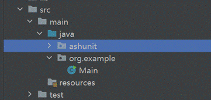
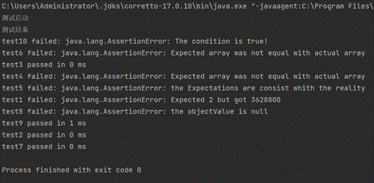

# Ashunit

a plain tool for unit testing

对Junit的部分功能复现，实现“安排-行动-断言”的测试流程

在学习了Junit的工作逻辑之后，我尝试自己编写一个单元测试的框架，实现Junit中的主要断言库，命名为AshUnit，项目地址：

其中的example文件中包含一些简单的使用示例

它包括以下核心组件

​        **测试 runner**：利用java语言的自定义注解和反射机制，扫描ExampleTests，发现和执行测试用例。   **断言库api**：提供用于验证测试结果的断言方法，以及自定义的测试注解   **测试用例ExampleTests：**在其中编写测试函数，可以对项目中的public函数利用断言功能测试       

 

AshUnit目前实现的注解：

| 注解           | 说明                 |
| -------------- | -------------------- |
| @AshTest       | 表示方法是测试方法。 |
| @AshBeforeTest | 测试开始。           |
| @AshAfterTest  | 测试结束。           |

 

AshUnit目前的断言库：

| 方法名称         | 方法描述                               |
| ---------------- | -------------------------------------- |
| assertEquals     | 断言传入的预期值与实际值是相等的。     |
| assertNotEquals  | 断言传入的预期值与实际值是不相等的。   |
| assertArayEquals | 断言传入的预期数组与实际数组是相等的。 |
| assertNull       | 断言传入的对象是为空。                 |
| assertNotNull    | 断言传入的对象是不为空。               |
| assertTrue       | 断言条件为真。                         |
| assertFalse      | 断言条件为假。                         |

 

部署：

1.将ashunit文件夹加入目标项目的目录下，并确保文件ashunit的import正确，示例如下



2.在ashunit下的ExampleTests.java文件中编写测试代码，导入其他项目头文件后，进行函数单元测试，示例如下

```
package ashunit;
 import ashunit.api.AshAfterTest;
 import ashunit.api.AshBeforeTest;
 import ashunit.api.AshTest;
 import static ashunit.api.Assertions.*;
 import static org.example.Main.fun1;
 import static org.example.Main.fun2;

 public class ExampleTests {
   @AshBeforeTest
   public void a(){System.out.println("测试启动");}
   @AshTest
   public void test1() {
     assertEquals(2, fun1(10));
   }
   @AshTest
   public void test2() {
     assertEquals(3628800,fun2(10) );
   }
   @AshTest
   public void test3(){
     int a[]={1,2,3};
     int b[]={1,2,3};
     assertArrayEquals(a,b);
   }
   @AshTest
   public void test4(){
     int a[]={1,2,3};
     int b[]={1,2,6};
     assertArrayEquals(a,b);
   }
   @AshTest
   public void test5(){
     assertNotEquals(1,4);
   }
   @AshTest
   public void test6(){
     int a[]={1,2,3};
     int b[]={1,2,6};
     assertArrayEquals(a,b);
   }
   @AshTest
   public void test7(){
     assertNull(null,"the objectValue is not null");
   }
   @AshTest
   public void test8(){
     assertNotNull(null,"the objectValue is null");
   }
   @AshTest
   public void test9(){
     assertTrue(true,"The condition is false!");
   }
   @AshTest
   public void test10(){
     assertFalse(true,"The condition is true!");
   }
   @AshAfterTest
   public void b(){System.out.println("测试结束");};

 }
```

 

3.运行runner模块下的StartTest.java，测试结果如下

